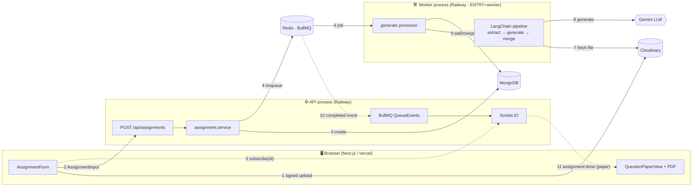
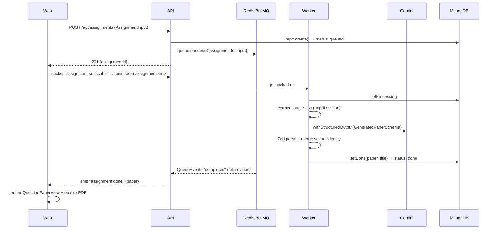

# VedaAI — AI Assessment Creator

A teacher describes an assignment (optional source material, due date, a table of
question types + marks, free-text hints); an LLM generates a **structured question
paper** (sections → questions → difficulty → marks → answer key); the teacher
reviews it in an exam-paper layout and downloads a formatted PDF.

The LLM response is **never rendered raw** — it is constrained to a Zod schema,
re-validated, merged with backend-owned school identity, and only then persisted
and shown.

| | |
|---|---|
| **Live app** | https://vedaai-assessment-creator-two.vercel.app |
| **API** | https://api-production-a331.up.railway.app |
| **Repo** | https://github.com/thecuriouscatmeow/vedaai-assessment-creator |
| **Tests** | shared 32 · api 108 · web 81 = **221 passing** |

---

## Tech stack

| Layer | Tech |
|---|---|
| **Frontend** | Next.js 16 (App Router) · TypeScript · Redux Toolkit · Tailwind v4 · Socket.IO client · `@react-pdf/renderer` |
| **Backend** | Express 5 · TypeScript · MongoDB (Mongoose) · Redis · BullMQ · Socket.IO |
| **AI** | LangChain + Gemini via provider-agnostic adapter; `withStructuredOutput` → Zod; `unpdf` (native PDF text) + Gemini-vision fallback for images/scanned PDFs |
| **Contract** | `@vedaai/shared` — Zod schemas; every type is `z.infer` (single source of truth) |
| **Uploads** | Frontend → Cloudinary (signed direct upload); backend stores the URL only |

---

## System design

Two processes share **only Redis + MongoDB**. The **worker never touches sockets** —
the API process owns Socket.IO and learns of job completion through a BullMQ
`QueueEvents` listener, then emits to the assignment's room.



### Request → paper lifecycle (sequence)



---

## Hosting topology

```
                            ┌──────────────────────────────┐
   github.com (public) ─────┤  CI: push → auto-deploy        │
                            └───────────────┬────────────────┘
                                            │
              ┌─────────────────────────────┼──────────────────────────────┐
              ▼                             ▼                               ▼
   ┌────────────────────┐      ┌────────────────────────┐       ┌────────────────────┐
   │ Vercel             │      │ Railway (1 Docker image,│       │ Managed data        │
   │ apps/web (Next 16) │      │  ENTRY selects entry)   │       │                     │
   │                    │      │                         │       │ • MongoDB Atlas M0  │
   │ NEXT_PUBLIC_API_URL├─HTTP─▶ api  service  (server.ts)│──────▶│ • Redis Cloud (BullMQ)
   │                    │◀─WS──┤  ↳ Express + Socket.IO   │       │ • Cloudinary (files)│
   └────────────────────┘      │ worker service (worker.ts)──────▶│ • Gemini (Google AI)│
                               │  ↳ ENTRY=worker          │       └────────────────────┘
                               └────────────────────────┘
```

**One image, two entrypoints.** `apps/api/Dockerfile` builds a single image;
the `ENTRY` env var (default `server`) chooses `src/server.ts` vs `src/worker.ts`
at container start (`tsx apps/api/src/${ENTRY:-server}.ts`). Railway runs it twice.

---

## Repository structure

```
vedaai/                          pnpm monorepo · Node ≥20
├── apps/
│   ├── web/                     Next.js frontend (deployed to Vercel)
│   │   └── src/
│   │       ├── app/             App Router routes (/, /assignments, /create, /[id])
│   │       ├── components/      AssignmentForm, QuestionPaperView, AssignmentPDF, nav/…
│   │       ├── store/           Redux Toolkit (makeStore + 4 slices)
│   │       ├── lib/             useAssignmentSocket, useCloudinaryUpload, config
│   │       └── content/copy.json   all UI copy (no inline strings)
│   └── api/                     Express API + BullMQ worker (deployed to Railway)
│       ├── Dockerfile           multi-stage; ENTRY=server|worker
│       └── src/
│           ├── server.ts        HTTP + Socket.IO + QueueEvents  (api service)
│           ├── worker.ts        BullMQ worker                    (worker service)
│           ├── app.ts           Express factory (middleware order)
│           ├── routes/          assignment.ts, upload.ts (Cloudinary sign)
│           ├── services/        assignment.service.ts (business logic)
│           ├── domain/          pipeline.ts (LangChain chain), prompt.ts
│           ├── adapters/        llm/ · extraction/ · db/ · storage/ · cache/
│           ├── middleware/      validate-body/params/output, sanitize, security, rate-limit
│           ├── models/          Mongoose: assignment, question-paper, question
│           └── lib/             config (Zod env), logger (pino), queue, redis, socket, school
├── packages/
│   └── shared/                  @vedaai/shared — Zod contract, imported by BOTH apps
│       └── src/schemas/         assignment · question-paper · socket · nav-item
├── railway.toml                 Dockerfile builder config
└── pnpm-workspace.yaml
```

---

## Data flow through the exact files

**Backend — create + generate path**

| Step | File | Responsibility |
|---|---|---|
| 1. Sign upload | `apps/api/src/routes/upload.ts` → `adapters/storage/cloudinary.adapter.ts` | Returns signed params; frontend uploads file directly to Cloudinary |
| 2. Receive request | `apps/api/src/app.ts` → `routes/assignment.ts` | `securityHeaders → rateLimit → cors → httpLogger → json(16kb)`; `POST /` runs `sanitizeBody → validateBody(AssignmentInputSchema)` |
| 3. Business logic | `apps/api/src/services/assignment.service.ts` | `repo.create()` then `queue.enqueue()`; rolls record to `failed` if enqueue throws |
| 4. Persist | `apps/api/src/adapters/db/assignment.repository.ts` + `models/*` | Normalized into `question_papers` + `questions` collections |
| 5. Enqueue | `apps/api/src/lib/queue.ts` | BullMQ job; `jobId = assignmentId` (idempotent, doubles as socket room key) |
| 6. Process job | `apps/api/src/worker.ts` → `createGenerateProcessor` | `findById → setProcessing → pipeline.invoke → setDone` (or `setFailed` + rethrow) |
| 7. Pipeline | `apps/api/src/domain/pipeline.ts` | LangChain chain: **extract → generate → merge** |
| 7a. Extract | `apps/api/src/adapters/extraction/index.ts` | Fetch Cloudinary file → `unpdf` text, Gemini-vision fallback for images/scanned PDFs |
| 7b. Generate | `apps/api/src/adapters/llm/generate.ts` + `domain/prompt.ts` | `model.withStructuredOutput(GeneratedPaperSchema).withRetry(2)`, then `Zod.parse` |
| 7c. Merge | `apps/api/src/lib/school.ts` | Backend injects `schoolName` / `schoolAddress` (model never sees them) |
| 8. Notify | `apps/api/src/lib/socket.ts` (`attachGenerateQueueEvents`) | `QueueEvents.completed` → validate `AssignmentDoneSchema` → `io.to(room).emit("assignment:done")` |

**Frontend — submit + render path**

| Step | File | Responsibility |
|---|---|---|
| 1. Form | `apps/web/src/components/AssignmentForm.tsx` + `store/slices/assignmentFormSlice.ts` | Validated form (no empty/negative); state in Redux |
| 2. Upload | `apps/web/src/lib/useCloudinaryUpload.ts` | Signed direct upload; sets `fileUrl` |
| 3. Create | `POST /api/assignments` via `apps/web/src/lib/config.ts` base URL | Returns `{assignmentId}` |
| 4. Subscribe | `apps/web/src/lib/useAssignmentSocket.ts` | Opens socket, emits `assignment:subscribe`, dispatches `generationSlice` on `done`/`failed` |
| 5. Render | `apps/web/src/components/QuestionPaperView.tsx` + `DifficultyBadge.tsx` | Exam-paper layout from typed `QuestionPaper` (never raw text) |
| 6. Export | `apps/web/src/components/AssignmentPDF.tsx` | `@react-pdf/renderer` formatted PDF (not HTML print) |
| 7. Regenerate | `apps/web/src/components/RegenerateBar.tsx` | Re-runs generation |

---

## The contract (`@vedaai/shared`)

Both apps import from one place; a field change ripples out via type errors.

| Schema | Shape (abridged) |
|---|---|
| `AssignmentInput` | `{ fileUrl?: url, dueDate: iso-date, questions: QuestionSpec[≥1], additionalInfo? }` |
| `QuestionSpec` | `{ type: 'mcq'\|'short'\|'diagram_graph'\|'numerical', count: int>0, marks: int>0 }` |
| `AssignmentStatus` | `'queued' \| 'processing' \| 'done' \| 'failed'` |
| `QuestionPaper` | `{ title, schoolName, subject, className, totalMarks, studentInfo, sections[≥1], … }` |
| `Section` | `{ title, instruction?, questions: Question[≥1] }` |
| `Question` | `{ text, difficulty, marks: int>0, answer? }` |
| `Difficulty` | `'easy' \| 'moderate' \| 'challenging'` |
| `GeneratedPaper` | `QuestionPaper` minus school identity (the model's output subset) |

---

## API & realtime

| Method | Path | Purpose |
|---|---|---|
| `GET` | `/health` | Liveness probe |
| `GET` | `/api/assignments` | List (`AssignmentSummary[]`) |
| `POST` | `/api/assignments` | Create + enqueue → `201 {assignmentId}` |
| `GET` | `/api/assignments/:id` | Detail (status, input, paper, error) |
| `DELETE` | `/api/assignments/:id` | Delete |
| `GET` | `/api/uploads/signature` | Cloudinary signed-upload params |

| Direction | Event | Payload |
|---|---|---|
| client → server | `assignment:subscribe` | `{ assignmentId }` → joins room |
| server → client | `assignment:done` | `{ assignmentId, paper }` |
| server → client | `assignment:failed` | `{ assignmentId, error }` |

---

## Local development

Requires **Node ≥ 20** and **pnpm** (`corepack enable pnpm`).

```bash
pnpm install
cp .env.example .env            # fill in values (see table below)

pnpm -r typecheck               # typecheck every workspace
pnpm -r test                    # 221 unit/integration tests
pnpm lint                       # ESLint (enforces no-console)

pnpm --filter @vedaai/api dev          # API + Socket.IO  (:4000)
pnpm --filter @vedaai/api worker       # BullMQ worker
pnpm --filter @vedaai/web dev          # Next.js app      (:3000)
```

Needs a local (or remote) **MongoDB** and **Redis** running. The API validates
every env var at boot (`lib/config.ts`) and fails fast with a readable message.

| Variable | Used by | Notes |
|---|---|---|
| `MONGODB_URI` | api, worker | Atlas URI in prod |
| `REDIS_URL` | api, worker | BullMQ + caching |
| `GEMINI_API_KEY` | worker | Google AI Studio key |
| `GEMINI_MODEL` | worker | optional; default `gemini-3.1-flash-lite` |
| `CLOUDINARY_CLOUD_NAME` / `_API_KEY` / `_API_SECRET` | api | Signed uploads |
| `WEB_ORIGIN` | api | Strict CORS + Socket.IO origin |
| `NEXT_PUBLIC_API_URL` | web | API base URL |

---

## Engineering approach

- **Layered + provider-agnostic adapters** — `route → service → domain → Zod contract → adapter`.
  Every external dependency (LLM, DB, queue, storage, cache) sits behind an interface, so a
  provider swap touches one file and never ripples.
- **Single source of truth for types** — Zod schemas in `packages/shared`; all types are `z.infer`.
  No hand-written, drift-prone definitions.
- **Never render raw AI** — the model is constrained to `GeneratedPaperSchema`, re-validated with
  Zod, and merged with backend-owned identity before persistence.
- **Decoupled processes** — API and worker share only Redis + Mongo; the worker is socket-free.
- **Structured logging** (pino) + central error middleware. No `console.log` (lint-enforced).
- **CSS-native responsive** — mobile-first, `rem`+`clamp()`, `dvh`, semantic Tailwind tokens.
- **TDD throughout** — 221 tests across the three workspaces; `mongodb-memory-server` for the
  repository layer, mocked socket/PDF/LLM at the edges.

### Bonus features implemented

✅ PDF export (`@react-pdf/renderer`, true layout) · ✅ Regenerate action bar · ✅ Visual
difficulty badges · ✅ Generated answer key · ✅ LangChain extraction pipeline (native PDF +
vision fallback) · ✅ Redis-backed queue state · ✅ Live WebSocket status.
</content>
</invoke>
